<div align="center">


</div>

---

##  **À Propos de Moi**


```typescript
const developpeur = {
    nom: "Votre Nom",
    statut: "Étudiant L3 Informatique",
    localisation: "Madagascar 🇲🇬",
    passions: ["Programmation", "Algorithmes", "Innovation"],
    apprentissage_actuel: ["Architecture Logicielle", "IA/ML"],
    objectif_2025: "Contribuer à des projets Open Source",
    
    code: function() {
        while(true) {
            this.apprendre();
            this.coder();
            this.optimiser();
            this.partager();
        }
    }
};
```

<br clear="right"/>

---

##  **Stack Technique**

<details open>
<summary><b>🌐 Langages de Programmation</b></summary>
<br>

<div align="center">

| Langage | Niveau | Animation |
|---------|--------|-----------|
|  | ⭐⭐⭐⭐ |  |
|  | ⭐⭐⭐⭐ |  |
|  | ⭐⭐⭐⭐ |  |
|  | ⭐⭐⭐ |  |
|  | ⭐⭐⭐ |  |
|  | ⭐⭐⭐ |  |

</div>
</details>

<details open>
<summary><b>🛠️ Frameworks & Bibliothèques</b></summary>
<br>

<p align="center">
  
  
  
  
  
  
  
</p>

</details>

<details open>
<summary><b>🗄️ Bases de Données</b></summary>
<br>

<p align="center">
  
  
  
  
</p>

</details>

<details open>
<summary><b>🔧 Outils & DevOps</b></summary>
<br>

<p align="center">
  
  
  
  
</p>

</details>


---

##  **Statistiques GitHub**

<div align="center">
   
  
</div>

<div align="center">
  
  
</div>

<div align="center">
  
</div>

---

##  **Projets en Vedette**

<div align="center">

<a href="https://github.com/votre-username/projet1">
  
</a>

<a href="https://github.com/votre-username/projet2">
  
</a>

</div>


---

## 🎯 **Centres d'Intérêt Tech**

```mermaid
mindmap
  root((Développement))
    Backend
      API REST
      Microservices
      Architecture
    Frontend
      SPA
      Responsive
      UI/UX
    Data Science
      Algorithmes
      Structures
      Optimisation
    DevOps
      Docker
      CI/CD
      Git Flow
```

<div align="center">



</div>

---

## 📈 **Contribution Graph**

<div align="center">


</div>

---

## 🐍 **Contribution Snake**

<div align="center">

<picture>
  <source media="(prefers-color-scheme: dark)" srcset="https://raw.githubusercontent.com/votre-username/votre-username/output/github-contribution-grid-snake-dark.svg">
  <source media="(prefers-color-scheme: light)" srcset="https://raw.githubusercontent.com/votre-username/votre-username/output/github-contribution-grid-snake.svg">
  
</picture>

</div>

---

## 📫 **Contactez-moi**

<div align="center">

<a href="mailto:votre.email@example.com">
  
</a>
<a href="https://linkedin.com/in/votre-profil">
  
</a>
<a href="https://github.com/votre-username">
  
</a>
<a href="https://twitter.com/votre-twitter">
  
</a>

</div>

---

<div align="center">

### 💭 **Citation du Jour**


---

### 🎮 **Fun Fact**


---


### 💡 *"Talk is cheap. Show me the code."* - Linus Torvalds


---


</div>


</div>